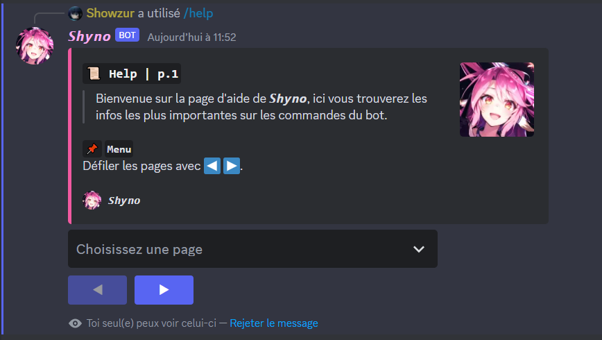
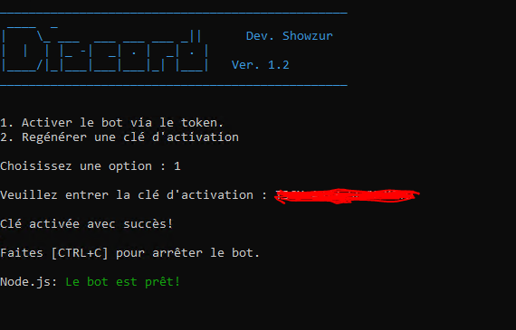

<h1 align="center">ShynoBot </h1>

<p>
<p align="center">
<a href="https://github.com/Macxzew/ShynoBot/releases">

</a>
</p>

> **ShynoBot** is a robust and multifunctional Discord bot, designed for efficient moderation and enhanced user interaction. It stands shoulder to shoulder with popular bots such as Koya, MEE6, Carl, and Dyno. In addition to its powerful moderation features, ShynoBot offers a variety of interactive commands, customization options, and server administration functions.



##  👇 Downloads

[](https://github.com/Macxzew/ShynoBot/releases/latest)

##  📥 Installation

- **For Windows:**

  I. Ensure that [`Python 3.9.4`](https://www.python.org/ftp/python/3.9.4/python-3.9.4-amd64.exe), [`Node.js 16.13.0`](https://nodejs.org/dist/v16.13.0/node-v16.13.0-x64.msi) are installed on your machine.

  II. Open a terminal window and run the following commands:
  ```cmd
  cd ShynoBot/bot
  python.exe -m pip install --upgrade pip && pip install -r requirements.txt
  npm install -g npm@9.8.1
  npm install
  ```

  III. Put your [Discord Bot token](https://discord.com/developers/applications) in `config.json`

- **For Linux:**

  I. Ensure that `Python 3.11.2`, `Node.js 18.13.0` are installed on your machine.

  II. Open a terminal and run the following commands:
  ```
  apt update
  apt install git python3 python3-pip curl
  curl -o- https://raw.githubusercontent.com/nvm-sh/nvm/v0.39.1/install.sh | bash

  export NVM_DIR="$([ -z "${XDG_CONFIG_HOME-}" ] && printf %s "${HOME}/.nvm" || printf %s "${XDG_CONFIG_HOME}/nvm")"
  [ -s "$NVM_DIR/nvm.sh" ] && \. "$NVM_DIR/nvm.sh"

  nvm install 18.13.0
  git clone https://github.com/Macxzew/ShynoBot.git
  cd ShynoBot/bot
  pip3 install -r requirements.txt
  npm install
  ```

  III. Put your [Discord Bot token](https://discord.com/developers/applications) in `config.json`

## 🛠️ Usage

After successfully installing the necessary dependencies and setting up the environment, you can start ShynoBot on both Linux and Windows by executing the following command:
```
node start.js
```


Upon launching the bot, you will be presented with two options:
1. **Activate the bot using an Activation Key:** This is the first option that will be available to you. After purchasing the bot, you will be provided with an activation key. Use this key to start and operate your bot.
2. **Regenerate an Activation Code:** If you ever need to regenerate an activation code, you will need the old activation code and a password. These details will be provided to you upon purchase. It's important to note that the password is not the same as your Discord password. Instead, it's a unique password that I provide for the purpose of code regeneration.

Please keep both your activation code and password safe and secure. For any further queries or support, feel free to reach out to me directly.

## 👤 Author

**Showzur**

* SRV Discord: [Shynonime](https://discord.gg/B9PrK625xp)
* Twitter: [@Macxzew](https://twitter.com/Macxzew)
* Github: [@Macxzew](https://github.com/Macxzew)

## Show your support

Give a ⭐️ if this project helped you!

***
